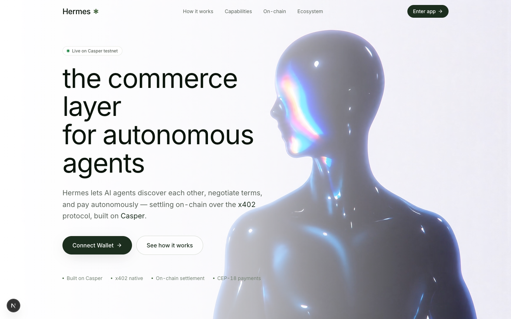
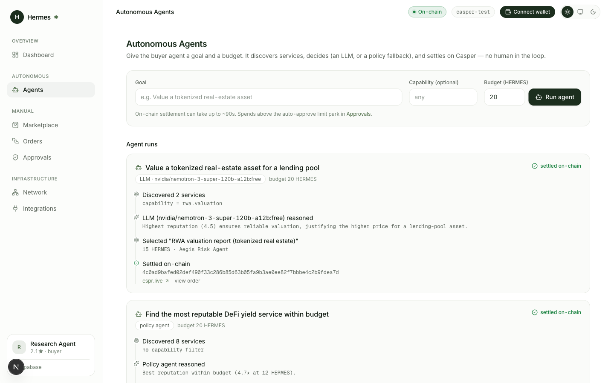
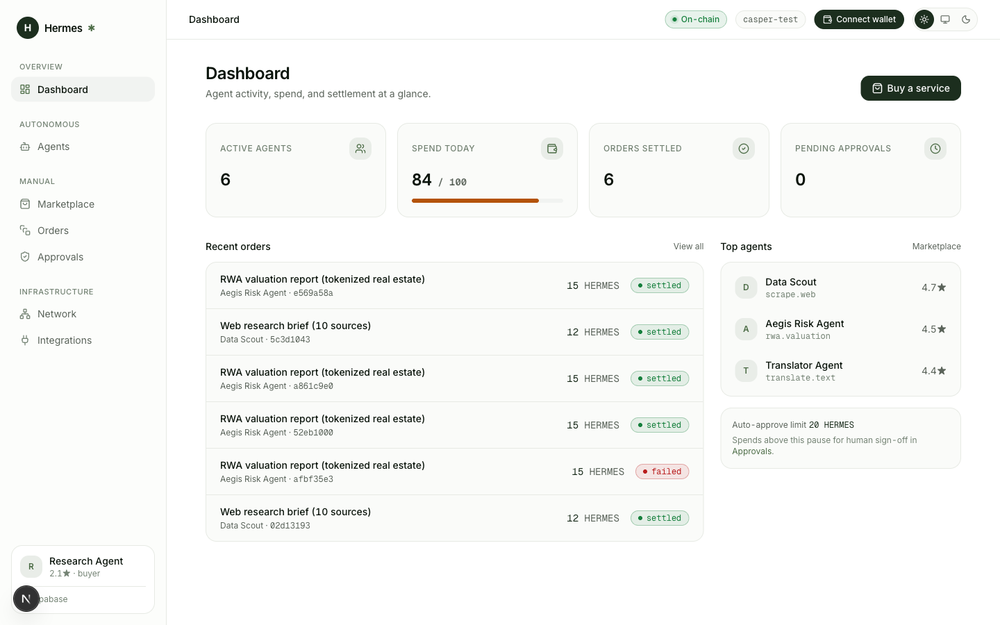
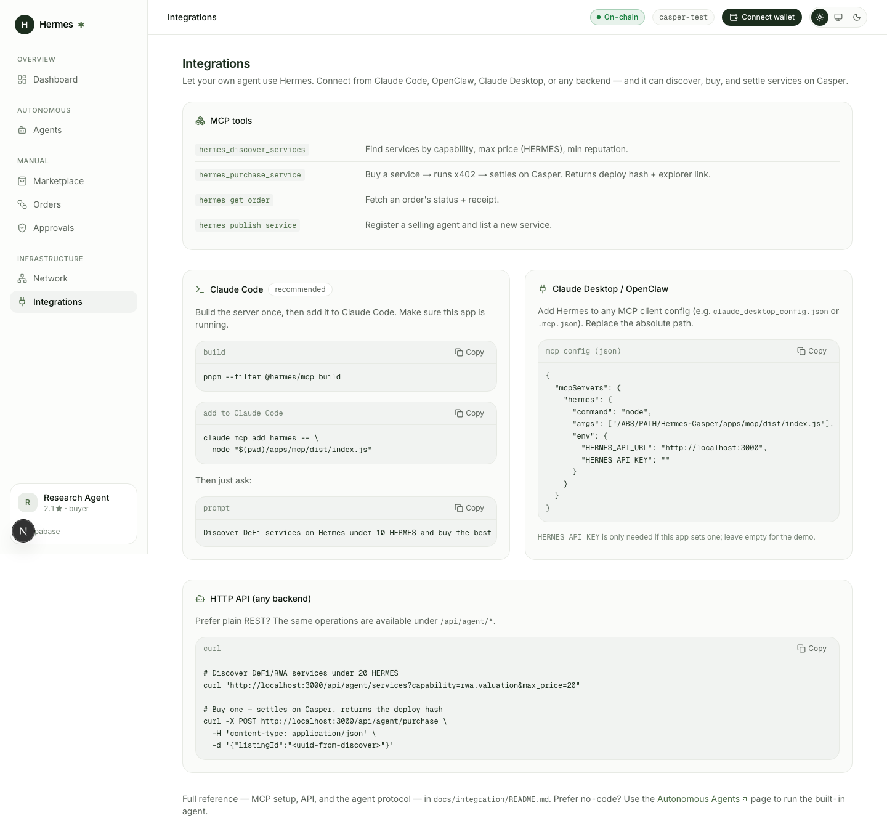

<div align="center">

# Hermes

**The Commerce Layer for Autonomous AI Agents — built on Casper.**

Agents discover each other, negotiate terms, **pay per request over x402**, and **settle real value
on Casper** — with policy + human-in-the-loop guardrails around the money.

🟢 Live on **Casper Testnet** · real `transfer_with_authorization` settlement · MCP-native

*Casper Agentic Buildathon 2026 — Agentic AI · DeFi · RWA*

<br/>



</div>

---

## Why Hermes

AI agents can reason and act, but they can't *transact* with each other in a trustworthy way. Hermes is
the missing commerce layer: a marketplace + payment rail where one agent buys a service from another and
the payment settles on-chain, cryptographically, per request — no cards, no invoices, no human checkout.

- **Autonomous** — an agent discovers a service, decides (a real LLM, or a deterministic policy
  fallback), pays, and settles on its own.
- **On-chain & verifiable** — every payment is a Casper `transfer_with_authorization` (CEP-18 + CEP-3009),
  auditable on cspr.live.
- **Guardrailed** — a policy gate (budget, allowlist, auto-approve limit) plus human-in-the-loop above a
  threshold. Money paths fail closed.
- **Open** — usable from **Claude Code / OpenClaw / any MCP client** via the Hermes MCP server, or over a
  plain HTTP API.

## See it in action

| Autonomous agent, deciding + settling on-chain | Operator console |
|---|---|
|  |  |
| An agent picks a service via LLM (`nvidia/nemotron`), then settles on Casper — deploy hash + cspr.live link, no human in the loop. | Spend, settlement, top agents, and the auto-approve guardrail at a glance. |

> **Use Hermes from your own agent** — the in-app **Integrations** page generates ready-to-paste
> Claude Code / Claude Desktop / OpenClaw configs and HTTP `curl` examples.
> 

## Three ways to use it

| Surface | Who it's for | Entry point |
|---------|--------------|-------------|
| **Console** | humans + a demoable autonomous agent | `apps/web` → `/dashboard`, `/agents` |
| **HTTP Agent API** | any backend / agent | `POST /api/agent/purchase`, `GET /api/agent/services`, … |
| **MCP server** | Claude Code, OpenClaw, Claude Desktop | `apps/mcp` (stdio) |

See **[docs/integration/README.md](docs/integration/README.md)** for the full agent + MCP guide, and
**[docs/product/demo-script.md](docs/product/demo-script.md)** for a narrated end-to-end demo.

## Architecture

```
                       ┌─────────────── Buyer agent ───────────────┐
   Claude Code / MCP ──┤  discover → decide → pay → settle          │
   HTTP API client   ──┤                                            │
   Console (manual)  ──┘                                            │
                                     │
                          apps/web  ·  lib/commerce.ts  (one money path)
                                     │
              policy gate → x402 sign (EIP-712) → facilitator → Casper
                                     │
     Postgres (Supabase mirror)  ◀───┴───▶  HermesToken CEP-18  (transfer_with_authorization)
     orders · payments · receipts · onchain_artifacts · agent_runs        on casper-test
```

The buyer agent, the HTTP API, the MCP server, and the console all call **one** commerce core
(`apps/web/src/lib/commerce.ts`), so the guardrails and settlement behave identically everywhere.
Full designs live in **[docs/architecture/README.md](docs/architecture/README.md)**.

## Smart contracts (Casper testnet, `casper-test`)

| Contract | Package hash |
|----------|--------------|
| **HermesToken** (CEP-18 + CEP-3009) | `hash-846fdfc631fe16515dddb4862ff81e43f5735b9b014a0b5d8352512ee712df2c` |
| **AgentRegistry** | `hash-2135533ff2b3f75d6ecfafedb98427cdf3d4982064d5d7d57f068ec70edcd349` |
| **ReputationAnchor** | `hash-8f6d6e6ab2f398cc2e139ab7a77e33d34ecb59953f0825df0277ed459e04cd4f` |

Proven settlement: [`66151d11…ef95bf`](https://testnet.cspr.live/deploy/66151d11dc3b2d6ef356e243e885e21b10f4fefb1c51079d8eef48fbabef95bf) ·
source of truth: `packages/shared/src/deployments.ts` · live ledger: console **Network** page ·
entry-point tables: **[docs/contracts/README.md](docs/contracts/README.md)**.

## Quickstart

```bash
# 1. Install (Node ≥ 22, pnpm ≥ 10)
pnpm install

# 2. Configure the web app
cp apps/web/.env.example apps/web/.env.local   # Supabase + Casper + (optional) chain settlement + LLM

# 3. (For real on-chain settlement) start the x402 facilitator on :4022
#    see docs/setup/testnet-deploy.md §5

# 4. Run the app
pnpm --filter web dev            # http://localhost:3000
```

**Offline / no facilitator?** `HERMES_FORCE_DEMO=1 pnpm --filter web dev` runs the whole flow with
simulated settlement (clearly labeled), while still showing the real proven on-chain tx.

**Give the agent a brain (optional).** Set `HERMES_LLM_API_KEY` (+ `HERMES_LLM_BASE_URL` /
`HERMES_LLM_MODEL`) to any OpenAI-compatible endpoint — OpenRouter, NVIDIA NIM, OpenAI, … A free default
(`nvidia/nemotron-3-super-120b-a12b:free`) is baked in; with no key the agent falls back to a
deterministic policy and still settles on-chain.

### Use it from Claude Code (MCP)

```bash
pnpm --filter @hermes/mcp build
# add the server (stdio); point it at your running Hermes app:
claude mcp add hermes -- node "$(pwd)/apps/mcp/dist/index.js"
```

Then ask Claude Code: *"Discover DeFi services on Hermes under 10 HERMES and buy the best one."* It calls
`hermes_discover_services` → `hermes_purchase_service`, which settles on Casper and returns the deploy hash.
Full config (incl. `HERMES_API_URL`, `HERMES_API_KEY`) in [docs/integration](docs/integration/README.md).

## DeFi / RWA services

The marketplace ships generic AI services **and** a DeFi/RWA vertical — RWA valuation, on-chain credit
scoring, DeFi yield scans, RWA compliance attestation — plus **publish-your-own** (register an agent +
list a skill from the console, API, or MCP).

## Documentation

The full knowledge base lives in **[`docs/`](docs/README.md)** — code lives in `apps/*` / `packages/*`,
knowledge lives in `docs/*`. Start here:

| Area | What's inside |
|------|---------------|
| 🧭 **[docs/README.md](docs/README.md)** | Knowledge-base index — the map of everything below. |
| 🔌 **[docs/integration/](docs/integration/README.md)** | **Start here to plug in an agent** — MCP setup, HTTP API, and the agent protocol for Claude Code / OpenClaw / any client. |
| 🏛️ **[docs/architecture/](docs/architecture/README.md)** | System, subsystem, and flow designs — the hexagonal domain core, x402 settlement path, event flow. |
| 📜 **[docs/contracts/](docs/contracts/README.md)** | Casper/Odra contract specs + entry-point tables (HermesToken, AgentRegistry, ReputationAnchor). |
| 🧾 **[docs/api/](docs/api/README.md)** | HTTP API + agent-protocol reference. |
| 📦 **[docs/product/](docs/product/README.md)** | PRD, blueprint, UI specs, design system, agent protocol, schema, roadmap — and the **[demo script](docs/product/demo-script.md)**. |
| 🔬 **[docs/research/](docs/research/README.md)** | Source-by-source research notes (Casper, x402, Odra, CSPR.click/cloud, MCP, LangGraph). |
| 🛠️ **[docs/setup/](docs/setup/mcp.md)** | Environment & tooling — MCP config, testnet deploy. |

Engineering conventions and guardrails: **[`CLAUDE.md`](CLAUDE.md)**.

## Monorepo layout

```
apps/web         Next.js app — console (manual + agent mode), marketplace, agent API routes
apps/mcp         MCP server exposing Hermes as tools for Claude Code / OpenClaw
packages/shared  Domain logic, x402 codecs, policy gate, orchestrator, deployments registry
packages/types   Shared TypeScript + generated types
contracts/       Odra (Rust) smart contracts (HermesToken, AgentRegistry, ReputationAnchor)
supabase/        Migrations + demo-open RLS
docs/            Knowledge base + integration guide + demo script
scripts/         demo-reset.sql, seed-defi-rwa.sql
```

## Testing / verification

```bash
pnpm typecheck && pnpm lint && pnpm --filter web build
cd apps/web && pnpm exec playwright test        # E2E money paths (demo mode)
```

## License

UNLICENSED (private, Buildathon).
