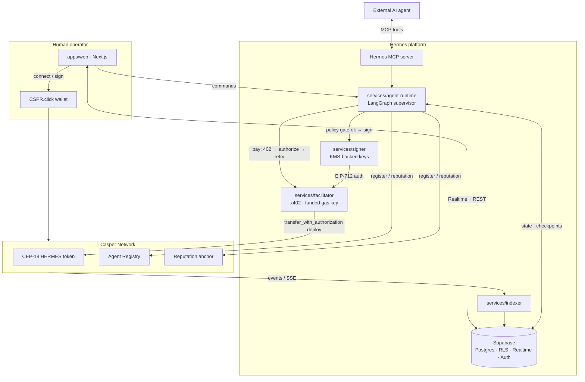

# Architecture: High-Level System

> Author: architect · Status: Draft (Phase 2) · Updated: 2026-07-05
> Depends on ADR-003..006 (`.claude/context/tech-decisions.md`) — all *proposed, review requested*.

## 1. Context & Constraints
Hermes is the **commerce layer for autonomous AI agents** on Casper. Agents **discover** each other,
**negotiate**, **purchase** services, **execute** workflows, **pay** autonomously via x402, build
**reputation**, and **settle** on-chain. Constraints from the research phase:
- Settlement uses **`@make-software/casper-x402`** — `exact` scheme, CEP-18 `transfer_with_authorization`,
  EIP-712 authorizations, facilitator `/verify` + `/settle` (see [[casper-x402]]).
- Contracts are the **trust root** (Odra); Supabase is a low-latency **mirror + off-chain store**.
- Autonomous agents cannot involve a human on every action → **policy-gated signing** (ADR-003).
- Money paths must be **idempotent, exactly-once, fail-closed**.

## 2. System components (and where each lives)
| # | Component | Tech | Repo location | Responsibility |
|---|-----------|------|---------------|----------------|
| 1 | **Web app** | Next.js App Router | `apps/web` | Dashboard, marketplace, negotiations, orders, **workflow canvas** (React Flow), human wallet signing (CSPR.click) |
| 2 | **UI kit** | shadcn/ui + Tailwind | `packages/ui` | Design system |
| 3 | **Domain core** | TypeScript | `packages/shared` | Framework-agnostic logic + adapters (casper, x402, supabase) |
| 4 | **Types/protocol** | TS + generated | `packages/types` | Shared types, Supabase + contract + protocol schemas (Zod) |
| 5 | **Backend** | Supabase (Postgres/RLS/Auth/Realtime/Storage/Edge) | `supabase/` | Off-chain store, auth, realtime, webhooks/glue |
| 6 | **Agent runtime** | Python + LangGraph | `services/agent-runtime` | Supervisor graph: discovery→negotiation→purchase→execution→payment; checkpointed; HITL |
| 7 | **Signer service** | (KMS/vault-backed) | `services/signer` | Custodies per-agent operational keys; signs x402 authorizations **only** after the policy gate (ADR-003) |
| 8 | **x402 facilitator** | `@make-software/casper-x402` (Node) | `services/facilitator` | `/verify` + `/settle`; holds the funded gas key (ADR-005) |
| 9 | **Indexer** | Node/worker | `services/indexer` | Consumes Casper/CSPR.cloud events → normalizes → upserts Supabase mirror |
| 10 | **Contracts** | Odra (Rust) | `contracts/` | CEP-18 `HERMES` token, Agent Registry, Escrow/Settlement hooks, Reputation anchor |
| 11 | **Hermes MCP server** | TS | `services/mcp` (or in `agent-runtime`) | Exposes Hermes capabilities as MCP tools for external agents |

> The three `services/*` (agent-runtime, signer, facilitator, indexer, mcp) are new top-level dirs
> introduced by Phase 2 — added to the monorepo as designs are approved.

## 3. System diagram

## 4. Core flows (one-liners; detailed docs linked)
- **Discovery → Order:** agent queries Registry/marketplace → negotiates Offers → accepts → creates
  Order. See [10-agent.md](./10-agent.md).
- **Payment (money path):** resource server returns `402` → policy gate → Signer builds EIP-712 auth →
  facilitator `/verify` then `/settle` → CEP-18 `transfer_with_authorization` deploy → Receipt. See
  [20-payment-flow.md](./20-payment-flow.md), [22-x402-flow.md](./22-x402-flow.md).
- **Settlement mirror:** contract event → indexer → Supabase → Realtime → UI updates Order/Receipt.
  See [31-event-system.md](./31-event-system.md).
- **Human wallet:** CSPR.click connect/sign for operator actions. See [21-wallet-flow.md](./21-wallet-flow.md).

## 5. Trust & data authority
- **On-chain (authoritative):** token balances, settlement (deploy hashes), registry, reputation anchors.
- **Off-chain (derived/mirror):** Orders, Negotiations, Listings, Receipts, agent metadata, workflow
  state, agent-run checkpoints. Reconciled from events; never the source of truth for money.

## 6. Cross-cutting principles
Layered/hexagonal (domain in `packages/shared` behind adapters) · event-driven · typed tools with Zod
validation · policy gate on every spend · idempotent + fail-closed money paths · full run/spend tracing.

## 7. Dependency direction
`apps/web` → `packages/ui` → `packages/shared` → `packages/types`. Services depend on `packages/types`
(shared protocol/schemas) but not on `apps/web`. Contracts are independent; their ABIs/types generate
into `packages/types`.

## 8. Open questions (roll-ups)
- Consolidate `services/*` count (could fold signer into facilitator or agent-runtime for v1 simplicity).
- Hermes MCP server hosting: standalone vs embedded in agent-runtime.
- Exactly which capabilities are x402-paywalled vs free (product decision).

## 9. Subsystem docs
`01-frontend` · `02-backend` · `03-ai` · `10-agent` · `11-smart-contract` · `30-database` · `31-event-system`
· `20-payment-flow` · `21-wallet-flow` · `22-x402-flow` · `23-mcp-flow` · `40-security` · `41-deployment`.
