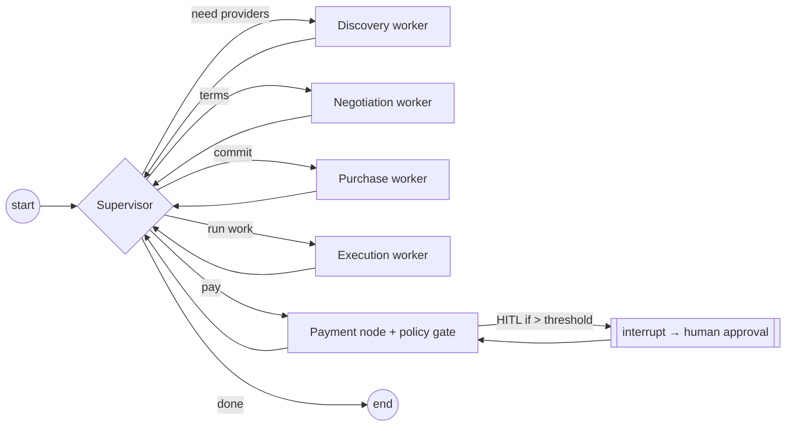

# Architecture: Agent Orchestration

> Status: Draft (Phase 2) · Updated: 2026-07-05 · ADR-004 (Python LangGraph service). See [[langgraph-agents]].

## Purpose
The LangGraph supervisor graph that turns intent into commerce: discovery → negotiation → purchase →
execution → payment, with durable state and human-in-the-loop on spend.

## Runtime
`services/agent-runtime` (Python, LangGraph). Exposes an internal HTTP API (start/resume run, get state)
+ optionally the Hermes MCP surface. Checkpointer backed by **Supabase Postgres** (keyed by `thread_id`
= run id). Long-running graphs live here, **not** in Supabase Edge Functions.

## Supervisor graph

## Workers (each a bounded set of tools)
- **Discovery** — query Agent Registry / marketplace (Listings) by capability, price, reputation.
- **Negotiation** — exchange Offers (propose/counter/accept), bounded rounds, guardrails on price/terms.
- **Purchase** — create Order from an accepted Offer; pre-verify payment (`/verify`).
- **Execution** — invoke the purchased service (may be an x402-paid tool call) and collect results.
- **Payment** — policy gate → Signer → facilitator `/settle` → Receipt (see [20-payment-flow.md](./20-payment-flow.md)).

## State (typed, checkpointed)
`run_id`, `intent`, `budget/remaining`, `candidates[]`, `offers[]`, `current_order`, `payment_state`,
`messages` (with `add_messages` reducer), `receipts[]`. Persisted every node for resume + HITL.

## Human-in-the-loop
`interrupt()` on spend above threshold (and other high-impact steps). The web app renders the pending
approval; resuming sends a `Command` back into the graph. See [21-wallet-flow.md](./21-wallet-flow.md).

## External agents
Third-party agents interact via the **Hermes MCP server** ([23-mcp-flow.md](./23-mcp-flow.md)) — same
tool contracts, same policy gate. They can be buyers or sellers in the marketplace.

## Open questions
- Multi-agent topology: single supervisor for v1; swarm/hierarchical later for agent-to-agent handoffs.
- How much execution runs inside the graph vs delegated to the counterparty's service.
- Concurrency model (many runs) + checkpointer connection pooling against Supabase.
