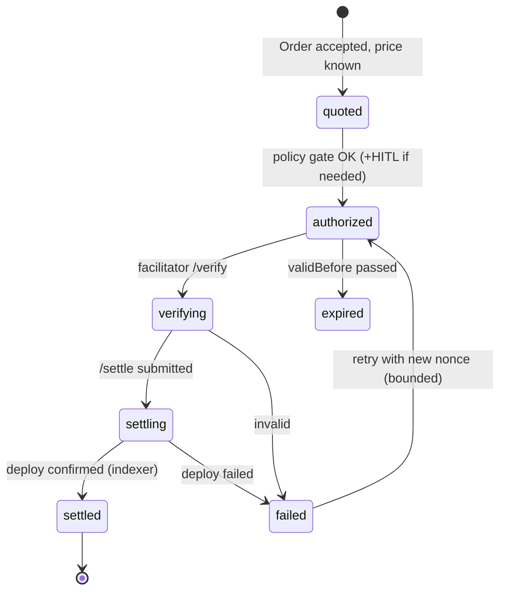

# Architecture: Payment Flow (Order → Settlement → Receipt)

> Status: Draft (Phase 2) · Updated: 2026-07-05 · Wraps [22-x402-flow.md](./22-x402-flow.md).

## Purpose
The business-level money path: how an accepted **Order** becomes a policy-approved **Payment**, an
on-chain **Settlement**, and a persisted **Receipt** — idempotently and fail-closed.

## Components
Agent runtime (payment node) · Policy Gate · Signer · Facilitator · Contracts (CEP-18) · Indexer ·
Supabase (`orders`, `payments`, `receipts`). See [[langgraph-agents]], [[x402-payments]].

## The policy gate (spend authorization)
Every spend passes before any signature:
1. **Budget check** — remaining budget for this run/agent/period ≥ amount.
2. **Allowlist check** — payee/asset/endpoint is permitted.
3. **Threshold check** — amount ≤ auto-approve limit? If not → **HITL interrupt** (LangGraph
   `interrupt`) surfaced in the web app for human approval.
4. **Emit intent** — write a `payment` row (`status=authorized`, nonce, amount, payee) *before* signing.

## Idempotency & consistency
- **One nonce per Payment**; `payments.nonce` unique. Re-entry with the same Order+quote reuses the row.
- Settlement truth comes from the **indexer** confirming the deploy on-chain, not from the facilitator's
  HTTP response alone (defense in depth). `receipts` row written on confirmed `settled`.
- `orders.status` transitions are driven by payment state via Realtime; the UI never marks paid itself.
- **Exactly-once:** a settled Payment cannot be re-settled; the contract's `transfer_with_authorization`
  + single-use nonce enforce this on-chain, mirrored by the unique constraint off-chain.

## Data touched
- `orders(id, buyer_agent, seller_agent, listing_id, price, asset, status, ...)`
- `payments(id, order_id, nonce UNIQUE, amount, payer, payee, status, deploy_hash, ...)`
- `receipts(id, payment_id, deploy_hash, amount, payer, payee, settled_at, raw PAYMENT-RESPONSE)`

## Failure modes
- Facilitator down → Payment holds in `authorized`; retry/backoff; alert (settlement SPOF, ADR-005).
- Deploy stuck/unknown → hold `settling`, reconcile via indexer; never optimistic-complete.
- HITL timeout → Order parks in `authorized`, notifies operator, auto-expires with the authorization.

## Open questions
- Refund/dispute path (service not delivered after settlement) — escrow contract vs reputation penalty?
- Streaming/metered payments later (x402 `exact` is fixed-amount only) — out of v1 scope.
