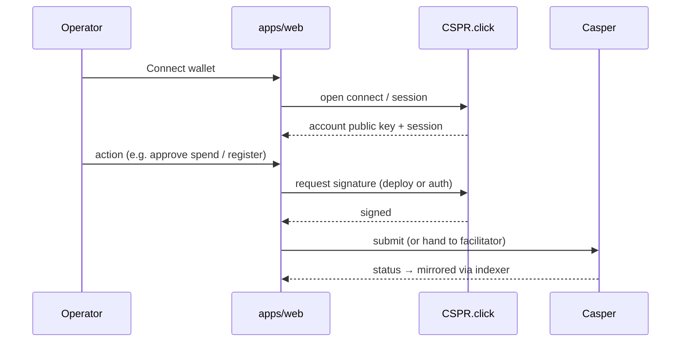
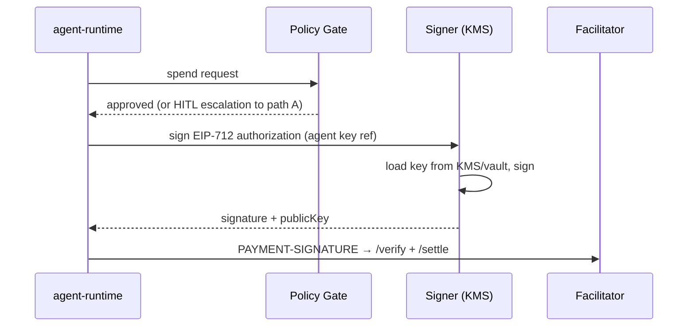

# Architecture: Wallet Flow

> Status: Draft (Phase 2) · Updated: 2026-07-05.

## Purpose
Two distinct signing paths: **human operators** (CSPR.click) and **autonomous agents** (Signer service,
ADR-003). Keep them cleanly separated — different trust models.

## A. Human operator (CSPR.click)
For operator actions in `apps/web`: connecting an account, funding an agent, registering, claiming, or
manually approving a high-value spend (HITL).

- Session/account stored client-side; link to the Supabase user (auth ↔ Casper identity).
- The web app never sees private keys; CSPR.click handles signing.

## B. Autonomous agent (Signer service)
For agent-initiated x402 authorizations with **no human present** (ADR-003):

- Per-agent **operational keys** live in a KMS/vault; the Signer never returns raw keys.
- Signer signs **only** on a policy-gate-approved request; every signature logs an auditable event.
- Spend caps + rate limits enforced at the Signer as defense in depth (not just the gate).

## Identity model
- A Hermes **Agent** maps to a Casper account (public key / account hash) + a Supabase record.
- Human operator ↔ Supabase user ↔ (optionally) their own Casper account via CSPR.click.
- Agents' operational keys are distinct from operators' personal wallets.

## Open questions
- Key lifecycle: rotation, revocation, per-agent derivation (HD) vs discrete keys.
- Does CSPR.click's signature format satisfy the facilitator's EIP-712 verification, or is the Signer
  the only viable path even for some human flows? (spike — see [22-x402-flow.md](./22-x402-flow.md)).
- KMS choice (cloud KMS vs HashiCorp Vault vs Casper-specific HSM).
