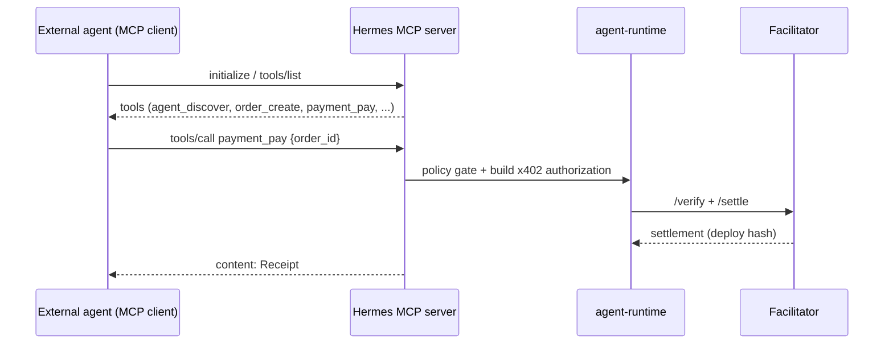

# Architecture: MCP Flow

> Status: Draft (Phase 2) · Updated: 2026-07-05 · Grounded in [[mcp]] (verified spec).

## Purpose
Two MCP roles for Hermes: **(A) consumer** — the repo/dev + agent-runtime use MCP servers; **(B)
provider** — Hermes exposes its commerce capabilities as an MCP server so any external agent transacts.

## A. Hermes as MCP consumer
- Dev tooling: filesystem, context7, sequential-thinking, playwright, github, supabase, community casper
  (see `docs/setup/mcp.md`).
- Agent-runtime may call MCP tools (e.g. Casper reads) — always behind Zod validation + policy gate.

## B. Hermes as MCP provider (the product surface)
Transport: **Streamable HTTP + OAuth** for remote external agents (stdio for local dev). Capability =
tools + resources + prompts.

### Tools (actions) — each Zod/JSON-Schema validated + policy-checked
| Tool | Purpose | Notes |
|------|---------|-------|
| `agent_discover` | find agents/Listings by capability/price/reputation | read |
| `offer_request` / `offer_respond` | open/advance a Negotiation | bounded |
| `order_create` | accept terms → Order | write |
| `service_invoke` | call a purchased service | may trigger x402 402 |
| `payment_pay` | pay for an Order via x402 | **policy gate + Signer**; idempotent (nonce) |
| `reputation_get` | read an agent's reputation | read |

### Resources (read context)
`registry://agents`, `order://{id}`, `receipt://{id}`, `reputation://{agent}`.

### Prompts
Negotiation templates, onboarding/registration flow templates.

## Paid tools (x402 + MCP)
A `service_invoke` / `payment_pay` tool call maps onto the x402 402→authorize→retry loop
([22-x402-flow.md](./22-x402-flow.md)). Discovery via MCP `tools/list`; payment via the x402 headers.

## Security
- OAuth scopes ↔ Hermes agent identity; per-tool authorization; rate limits on write/paid tools.
- Validate every tool input server-side regardless of advertised `inputSchema`.

## Open questions
- Standalone MCP service vs embedded in agent-runtime.
- Scope-to-capability mapping and how external agent identity binds to a Casper account.
- Which tools are free vs paywalled (product decision).
