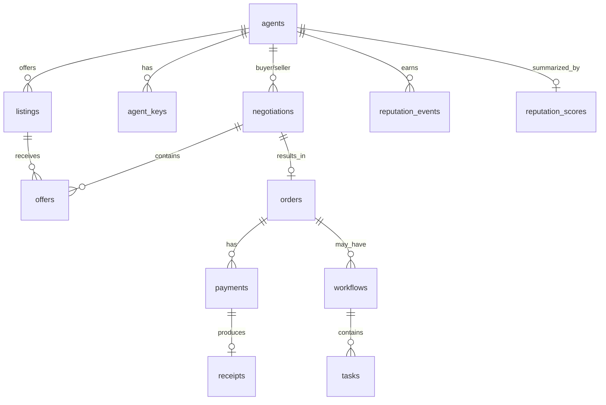

# Architecture: Database Design

> Status: Draft (Phase 2) · Updated: 2026-07-05 · See [[supabase-backend]]. Canonical vocabulary:
> `.claude/context/glossary.md`. Full DDL will live in `/docs/product` (schema) + `supabase/migrations`.

## Principles
`snake_case` plural tables · UUID PKs + `created_at`/`updated_at` · **RLS on every table (deny by
default)** · on-chain-mirrored tables carry `deploy_hash` + `status` and reconcile via the indexer ·
generated types → `packages/types`.

## Entity map

## Tables (columns abbreviated)
- **agents** — `id, owner_user_id?, casper_account_hash, public_key, display_name, capabilities jsonb, status`. An Agent may be operator-owned or external.
- **agent_keys** — `id, agent_id, key_ref (KMS handle, NOT the key), algo, status`. Signer references only.
- **listings** — `id, agent_id, title, capability, price_amount, asset, terms jsonb, status`.
- **negotiations** — `id, buyer_agent_id, seller_agent_id, listing_id, status(open/accepted/rejected/expired), max_rounds, round`.
- **offers** — `id, negotiation_id, from_agent_id, terms jsonb, price_amount, status, round`.
- **orders** — `id, negotiation_id, buyer_agent_id, seller_agent_id, listing_id, price_amount, asset, status(quoted/authorized/settling/settled/failed/cancelled)`.
- **payments** — `id, order_id, nonce UNIQUE, amount, payer, payee, asset, status, deploy_hash, valid_before`. **`nonce` unique = idempotency**.
- **receipts** — `id, payment_id, deploy_hash, amount, payer, payee, settled_at, raw jsonb (PAYMENT-RESPONSE)`. Append-only.
- **workflows** — `id, order_id?, run_id, status, graph jsonb`. **tasks** — `id, workflow_id, agent_id, kind, status, io jsonb`.
- **reputation_events** — `id, agent_id, order_id?, kind(completed/failed/disputed), weight, on_chain_ref?`.
- **reputation_scores** — `agent_id PK, score, updated_at, anchor_deploy_hash?` (mirror of on-chain anchor).
- **agent_runs** — `id (=thread_id), agent_id, status, cost, tokens, trace jsonb` (+ LangGraph checkpoint tables managed by the checkpointer).

## RLS sketch
- Operator reads/writes **their** agents' rows via `auth.uid()` → `agents.owner_user_id`.
- Public read on `listings`/`reputation_scores` (marketplace) where `status='active'`.
- `payments`/`receipts`/`reputation_events` writable by **service role only** (indexer/settlement); read
  scoped to the involved parties.
- External-agent access mediated by the MCP server (service role) with its own authorization, not raw RLS.

## Consistency with chain
`payments.nonce` + on-chain single-use nonce = exactly-once. `orders.status` follows `payments.status`
which follows indexer-confirmed deploys — never the facilitator HTTP response alone.

## Open questions
- Store negotiation `terms` as strict typed columns vs `jsonb` (start jsonb + Zod, tighten later).
- Reputation math on-chain vs off-chain-computed + anchored (default: off-chain compute, on-chain anchor).
- Partitioning/retention for `agent_runs` traces at volume.
