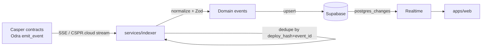

# Architecture: Event System

> Status: Draft (Phase 2) · Updated: 2026-07-05 · See [[casper-development]], [[supabase-backend]].

## Purpose
Keep the off-chain mirror and UI in sync with on-chain truth, event-driven, without polling the chain on
hot paths.

## Pipeline

## Event sources
- **Contract events** (registry updates, settlements, reputation anchors) via Odra `emit_event` →
  consumed from a node SSE feed or **CSPR.cloud** streaming (preferred; needs `CSPR_CLOUD_API_KEY`).
- **Facilitator settlement results** as a secondary signal — but on-chain confirmation via the indexer
  is authoritative for marking `settled`.

## Indexer responsibilities
- Subscribe, normalize to typed domain events, validate (Zod), and **upsert idempotently**
  (key = `deploy_hash` + event index). Never double-apply.
- Track a durable cursor/checkpoint so restarts resume without gaps or replays.
- Map events → table mutations: `payments/receipts`, `orders.status`, `agents/listings`,
  `reputation_events/scores`.
- Fail closed: on parse/uncertainty, quarantine the event + alert; don't guess money state.

## Delivery to UI
Supabase **Realtime** `postgres_changes` → client subscriptions. The **workflow canvas** (React Flow)
and order/receipt views react to these. Fallback: Edge Function cron poll of CSPR.cloud if streaming
drops.

## Ordering & idempotency
- Events are idempotent + commutative where possible; use monotonic on-chain ordering (block/deploy)
  to resolve sequence. Late/duplicate events are no-ops via the upsert key.

## Open questions
- CSPR.cloud streaming coverage for our specific contract events vs running our own SSE consumer.
- Backfill/replay tooling for a fresh mirror (rebuild from chain history).
- Throughput ceiling of Realtime for high agent-activity demos.
