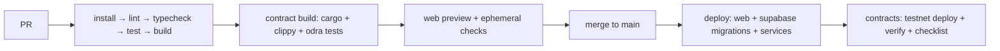

# Architecture: Deployment

> Status: Draft (Phase 2) · Updated: 2026-07-05 · See [[deployment]].

## Topology
| Component | Target (proposed) |
|-----------|-------------------|
| `apps/web` | Vercel (App Router; preview per PR) |
| Supabase (DB/Auth/Realtime/Storage/Edge) | Supabase managed project (per env) |
| `services/agent-runtime` (Python) | Container platform (Fly.io/Render/Cloud Run) — long-running |
| `services/facilitator` (Node) | Container; **funded gas key** in vault; network-restricted |
| `services/signer` | Container near KMS; **most isolated**; no inbound except from agent-runtime |
| `services/indexer` | Container/worker; durable cursor storage |
| `services/mcp` | Container (Streamable HTTP + OAuth) or embedded in agent-runtime |
| `contracts/` | Casper **testnet** (mainnet later, gated) |

## Environments
`local` (NCTL/testnet + local Supabase) → `staging` (testnet) → `production` (testnet for buildathon;
mainnet only post-audit). One Supabase project + one contract set per environment; env-scoped secrets.

## CI/CD

- **Required-green CI** before merge. Migrations applied via pipeline (not by hand). Rollback-able deploys.
- **Contract release:** build wasm → testnet deploy + verify → audit checklist → mainnet **only with
  explicit human approval**. Record deploy ids/package hashes in `/docs`.

## Secrets & config
Platform vault / CI secrets only. Keep `.env.example` current. Gas key, KMS creds, service-role key never
in git or client bundles. `X402_PAYMENT_TOKEN_CONTRACT` + facilitator URL threaded per env.

## Observability
Logs + traces (agent runs, spend), alerts on money-path failures (facilitator errors, stuck settlements,
policy-gate denials spikes). Uptime on facilitator/signer (settlement SPOF).

## Open questions
- Container platform choice + how services are grouped (fewer services for v1 ops simplicity).
- Managed KMS provider; region/data-residency.
- Whether to self-host a Casper node or rely on CSPR.cloud for reads/streaming.
