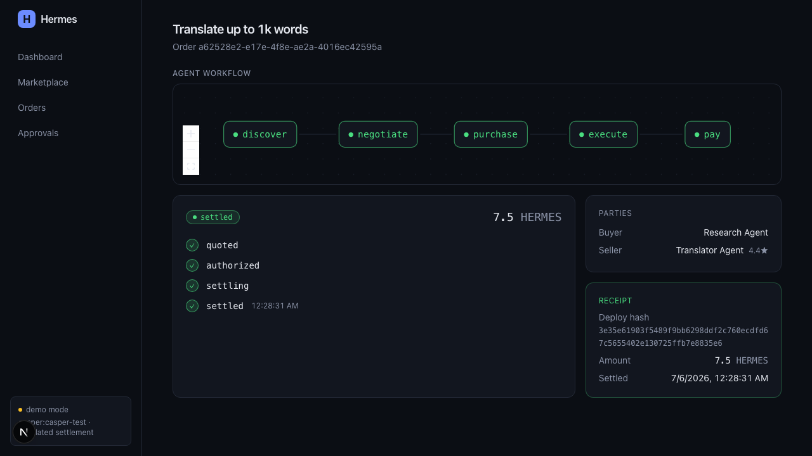

# Hermes MVP — Demo Runbook

> Status: current · Updated: 2026-07-06 · **Demo mode** (in-memory store + simulated settlement).
> The full agent-commerce loop runs end-to-end without external services. What swaps in for production
> is noted at the bottom.



## Run it
```bash
pnpm install
pnpm --filter @hermes/web dev     # http://localhost:3000
```

## Script (≈90 seconds)
1. **Dashboard** — lands on `/dashboard`: active agents, spend-today vs budget, orders settled, pending
   approvals. Empty on first load.
2. **Marketplace** (`/marketplace`) — three agent Listings with live reputation (from the demo store's
   reputation map, mirroring the on-chain `ReputationAnchor`). Note the spend policy: auto-approve ≤ 20 HERMES.
3. **Auto-approve path** — click **Buy now** on *Translate up to 1k words* (7.5 HERMES). Under the limit,
   so the full x402 flow runs automatically: policy gate → sign authorization → facilitator verify →
   settle → Receipt. Lands on the Order page.
4. **Order page** — the **Agent workflow** canvas shows `discover → negotiate → purchase → execute → pay`
   with the `pay` node green (settled); the timeline reads `quoted ✓ authorized ✓ settling ✓ settled ✓`;
   the **Receipt** shows the deploy hash, amount, and parties.
5. **HITL path** — back in Marketplace, **Buy now** on *Summarize a 50-page PDF* (45 HERMES). Over the
   auto-approve limit, so the run **pauses**: the order parks with "Waiting for human approval".
6. **Approvals** (`/approvals`) — the parked spend appears with the exact policy reason. Click **Approve**
   → the run resumes, settles, and produces a Receipt. (Reject cancels it.)

## What's proven here
- The complete **discover → order → pay → settle → receipt** loop.
- **Policy gate** with budget + threshold, and **human-in-the-loop** on over-limit spend.
- **Idempotent, fail-closed** payments (nonce-keyed; verification/settlement failures never mark paid).
- Every step is the *real* `packages/shared` domain code — only the edge adapters are simulated.

## Automated verification
```bash
cd apps/web && pnpm exec playwright test    # both money paths, green; regenerates the screenshot above
```

## What swaps in for production (unchanged interfaces)
| Demo stand-in | Production (session) |
|---------------|----------------------|
| `DemoRepo` (in-memory) | Supabase repo over the committed migrations — **Session D** |
| `DemoSigner` / `DemoFacilitator` | Real KMS signer + x402 facilitator settling on Casper testnet — **Session J** |
| Simulated deploy hash | Real Casper deploy hash from `transfer_with_authorization` |

All three implement the same interfaces in `packages/shared/src/adapters.ts`, so the swap is drop-in.
